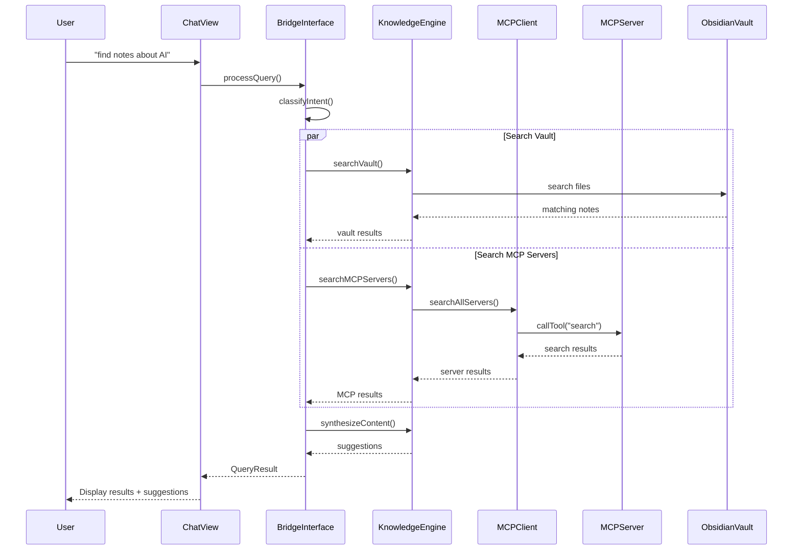

# Obsidian MCP Bridge

🔗 A powerful bridge connecting Model Context Protocol (MCP) servers with Obsidian for enhanced knowledge discovery, AI-powered workflows, and intelligent content synthesis.

## ✨ Features

### 🚀 **Production-Ready Core**

- **Full MCP Protocol Support**: Complete implementation with stdio, WebSocket, and SSE transports
- **Robust Error Handling**: Comprehensive retry logic with exponential backoff
- **Health Monitoring**: Real-time connection health checking and auto-reconnection
- **Type-Safe Architecture**: Full TypeScript implementation with comprehensive test coverage

### 🔍 **Knowledge Discovery**

- **Cross-Server Search**: Query multiple MCP servers simultaneously
- **Vault Integration**: Search your Obsidian vault with AI-powered relevance scoring
- **Content Synthesis**: Intelligent content recommendations and connections
- **Natural Language Interface**: Chat with your knowledge base using plain English

### 🛠️ **Developer Experience**

- **Comprehensive Testing**: 34 unit tests covering all core components
- **Clean Architecture**: Modular design with clear separation of concerns
- **Production Build**: Optimized bundling with esbuild
- **Development Tools**: Hot-reload development environment

## 🛠️ Installation

### From Obsidian Community Plugins (Coming Soon)

1. Open Obsidian Settings
2. Go to Community Plugins
3. Search for "MCP Bridge"
4. Install and enable

### Manual Installation

1. Download the latest release from GitHub
2. Extract to your vault's `.obsidian/plugins/obsidian-mcp-bridge/` directory
3. Enable in Obsidian Settings → Community Plugins

## 🚀 Quick Start

### 1. Configure MCP Servers

The plugin supports multiple connection types for different MCP servers:

#### **STDIO Servers** (Local processes)

```json
{
  "servers": {
    "filesystem": {
      "enabled": true,
      "name": "Local Filesystem",
      "type": "stdio",
      "command": "npx",
      "args": ["-y", "@modelcontextprotocol/server-filesystem", "/path/to/documents"],
      "timeout": 10000,
      "retryAttempts": 3
    }
  }
}
```

#### **WebSocket Servers** (Remote services)

```json
{
  "servers": {
    "remote-ai": {
      "enabled": true,
      "name": "Remote AI Service",
      "type": "websocket",
      "url": "ws://localhost:8080/mcp",
      "timeout": 15000,
      "retryAttempts": 5
    }
  }
}
```

#### **SSE Servers** (HTTP-based)

```json
{
  "servers": {
    "web-api": {
      "enabled": true,
      "name": "Web API Server",
      "type": "sse",
      "url": "https://api.example.com/mcp",
      "timeout": 20000,
      "retryAttempts": 3
    }
  }
}
```

### 2. Start Using

- **Command Palette**: `Ctrl/Cmd + P` → "MCP Bridge: Open Chat"
- **Natural Language**: Type "find my notes about machine learning"
- **Discovery Hotkey**: `Ctrl/Cmd + Shift + K` while writing
- **Auto-suggestions**: Get contextual content while editing

## 📖 User Guide

### Natural Language Commands

``` txt
"find my notes about distributed systems"
"search for recent papers on AI safety"
"show me code examples for rate limiting"
"what have I written about this topic?"
"get the latest news on cryptocurrency"
```

### Discovery Workflows

1. **While Writing**: Hit `Ctrl/Cmd + Shift + K` to discover related content
2. **Research Mode**: Use the chat interface for complex queries
3. **Auto-linking**: Let the plugin suggest connections as you write
4. **Content Enhancement**: Insert AI-generated summaries and analysis

## 🔧 Configuration

### Server Management

Configure MCP servers in the plugin settings:

- **Local Servers**: File system, Git repositories, databases
- **Remote Services**: Web search, APIs, cloud services
- **Custom Servers**: Your own MCP implementations

### Workflow Customization

- **Hotkeys**: Customize keyboard shortcuts
- **Templates**: Set up content templates
- **Auto-actions**: Configure automatic processing rules

## 🏗️ Architecture



### Core Components

- **MCP Client**: Protocol-compliant communication layer
- **Knowledge Engine**: Content analysis and synthesis
- **Bridge Interface**: Obsidian ↔ MCP translation
- **UI Components**: Chat, discovery, and settings interfaces

## 🛣️ Roadmap

### ✅ Phase 1: Foundation (Completed)

- [x] **Complete MCP Protocol Implementation** - Full stdio, WebSocket, and SSE support
- [x] **Robust Error Handling** - Retry logic, health monitoring, and connection recovery
- [x] **Core Plugin Architecture** - Clean separation of concerns with TypeScript
- [x] **Comprehensive Testing** - 34 unit tests covering all core components
- [x] **Production Build System** - Optimized bundling and development tools

### 🔄 Phase 2: Knowledge Discovery (In Progress)

- [x] **Cross-Server Search** - Query multiple MCP servers simultaneously
- [x] **Vault Integration** - Search Obsidian vault with AI-powered relevance scoring
- [x] **Basic Content Synthesis** - Intelligent content recommendations
- [x] **Natural Language Interface** - Chat with knowledge base using plain English
- [ ] **Advanced Link Discovery** - Automatic connection finding between ideas
- [ ] **Smart Content Insertion** - Context-aware content suggestions

### 🔮 Phase 3: Advanced Features (Planned)

- [ ] **Knowledge Graph Integration** - Visual representation of content relationships
- [ ] **Workflow Automation** - Automated content processing and organization
- [ ] **Advanced AI Interactions** - Multi-step reasoning and complex queries
- [ ] **Plugin Ecosystem** - Extensible architecture for custom integrations

## 🔐 Security

This plugin handles sensitive data including API keys and database credentials. Security best practices are built-in:

- **Automatic Secret Protection**: API keys are redacted from logs and error messages
- **Environment Variable Support**: Store sensitive configuration outside the codebase  
- **Input Validation**: All user inputs and MCP responses are validated
- **Secure Communication**: HTTPS/WSS required for external connections

**For Developers**: See [SECURITY.md](SECURITY.md) for comprehensive security guidelines.

## 🤝 Contributing

We welcome contributions! Please see our [Contributing Guide](docs/CONTRIBUTING.md) for details.

### Development Setup

```bash
# Clone the repository
git clone https://github.com/simplemindedbot/obsidian-mcp-bridge.git
cd obsidian-mcp-bridge

# Install dependencies
npm install

# Start development with hot-reload
npm run dev

# Run tests
npm test

# Run tests with coverage
npm run test:coverage

# Security scanning
npm run security:scan       # Scan for secrets
npm run security:check      # Full security audit

# Type checking
npm run type-check

# Build for production
npm run build

# Lint and format code
npm run lint
npm run format
```

### Current Status

- **Build Status**: ✅ Clean compilation and production builds
- **Test Coverage**: ✅ 34/34 tests passing (100% pass rate)
- **Type Safety**: ✅ Full TypeScript coverage with strict mode
- **Code Quality**: ✅ ESLint and Prettier configuration

### Project Structure

```text
src/
├── core/           # MCP protocol implementation
├── bridge/         # Obsidian ↔ MCP translation layer
├── ui/            # User interface components
├── knowledge/     # Knowledge discovery engine
├── types/         # TypeScript definitions
└── utils/         # Utility functions
```

## 📄 License

MIT License - see [LICENSE](LICENSE) file for details.

## 🙋 Support

- **Issues**: Report bugs on [GitHub Issues](https://github.com/simplemindedbot/obsidian-mcp-bridge/issues)
- **Discussions**: Join the conversation in [GitHub Discussions](https://github.com/simplemindedbot/obsidian-mcp-bridge/discussions)
- **Documentation**: Full docs at [docs/](docs/) and [Component Documentation](docs/components/)

## 🔗 Related Projects

- [Model Context Protocol](https://modelcontextprotocol.io/) - The underlying protocol
- [MCP Servers](https://github.com/modelcontextprotocol/servers) - Official MCP server implementations
- [MCP-SuperAssistant](https://github.com/srbhptl39/MCP-SuperAssistant) - Reference implementation for MCP client architecture
- [Obsidian](https://obsidian.md/) - The knowledge management platform

## 🙏 Acknowledgments

This project is built with inspiration and reference from:

- **[MCP-SuperAssistant](https://github.com/srbhptl39/MCP-SuperAssistant)** by [@srbhptl39](https://github.com/srbhptl39) - An excellent Chrome extension that demonstrates production-ready MCP client implementation patterns. We've used their architectural patterns for multi-transport connections, plugin-based design, and event-driven MCP client management.

- **[Model Context Protocol](https://modelcontextprotocol.io/)** by Anthropic - The foundational protocol that enables AI assistants to connect to data sources

- **[Obsidian](https://obsidian.md/)** - The powerful knowledge management platform this plugin extends

---

## Made with ❤️ for the Obsidian and MCP communities
