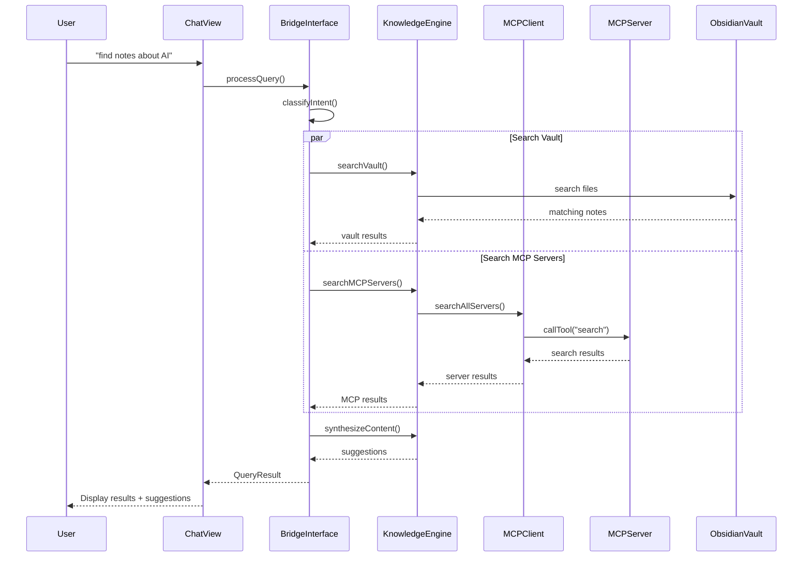

# Obsidian MCP Bridge

🔗 A powerful bridge connecting Model Context Protocol (MCP) servers with Obsidian for enhanced knowledge discovery, AI-powered workflows, and intelligent content synthesis.

> **🎉 Release v0.2.0** - Now with comprehensive note connection analysis! Discover relationships between your knowledge with AI-powered network analysis.

## ✨ Features

### 🚀 **Production-Ready Core**

- **Full MCP Protocol Support**: Complete implementation with stdio, WebSocket, and SSE transports
- **Robust Error Handling**: Comprehensive retry logic with exponential backoff
- **Health Monitoring**: Real-time connection health checking and auto-reconnection
- **Type-Safe Architecture**: Full TypeScript implementation with comprehensive test coverage

### 🔍 **Knowledge Discovery**

- **Cross-Server Search**: Query multiple MCP servers simultaneously
- **Enhanced Vault Search**: Native and plugin-enhanced search with Omnisearch integration
- **Note Connection Analysis**: Discover relationships between notes via links, tags, content, and concepts
- **Network Visualization**: Identify knowledge hubs, clusters, and missing connections
- **Content Synthesis**: Intelligent content recommendations and connections
- **Natural Language Interface**: Chat with your knowledge base using plain English

### 🛠️ **Developer Experience**

- **Comprehensive Testing**: 34 unit tests covering all core components
- **Clean Architecture**: Modular design with clear separation of concerns
- **Production Build**: Optimized bundling with esbuild
- **Development Tools**: Hot-reload development environment

## 🛠️ Installation

### From Obsidian Community Plugins (Coming Soon)

1. Open Obsidian Settings
2. Go to Community Plugins
3. Search for "MCP Bridge"
4. Install and enable

### Manual Installation

1. Download the latest release from GitHub
2. Extract to your vault's `.obsidian/plugins/obsidian-mcp-bridge/` directory
3. Enable in Obsidian Settings → Community Plugins

## 🚀 Quick Start

### 1. Configure MCP Servers

Configure MCP servers by editing the plugin's JSON configuration file directly. This approach provides maximum flexibility and allows for version control of your configurations.

#### **Configuration File Location**

Edit the plugin's configuration file at:

```bash
<vault>/.obsidian/plugins/obsidian-mcp-bridge/obsidian-mcp-bridge-config.json
```

#### **Example Configuration**

```json
{
  "servers": {
    "filesystem": {
      "enabled": true,
      "name": "Local Filesystem", 
      "type": "stdio",
      "command": "npx",
      "args": ["-y", "@modelcontextprotocol/server-filesystem", "/path/to/documents"],
      "timeout": 30000,
      "retryAttempts": 3
    },
    "web-search": {
      "enabled": false,
      "name": "Web Search",
      "type": "stdio", 
      "command": "npx",
      "args": ["-y", "@modelcontextprotocol/server-brave-search"],
      "timeout": 30000,
      "retryAttempts": 3,
      "env": {
        "BRAVE_API_KEY": "your-api-key-here"
      }
    },
    "remote-service": {
      "enabled": false,
      "name": "Remote WebSocket Service",
      "type": "websocket",
      "url": "ws://localhost:8080/mcp",
      "timeout": 15000,
      "retryAttempts": 5
    }
  }
}
```

#### **Server Types Supported**

- **stdio**: Local processes (filesystem, git, databases)
- **websocket**: Remote services with persistent connections  
- **sse**: HTTP-based servers with event streaming

### 2. Start Using

- **Command Palette**: `Ctrl/Cmd + P` → "MCP Bridge: Open Chat"
- **Natural Language**: Type "find my notes about machine learning"
- **Discovery Hotkey**: `Ctrl/Cmd + Shift + K` while writing
- **Auto-suggestions**: Get contextual content while editing

## 📖 User Guide

### Natural Language Commands

#### Vault Search
``` txt
"find my notes about distributed systems"
"search my vault for TypeScript"
"what have I written about machine learning?"
```

#### Note Connections
``` txt
"connect notes on artificial intelligence"
"connect ideas about project management"
"show connections between my React notes"
```

#### External Search
``` txt
"search for recent papers on AI safety"
"show me code examples for rate limiting"
"get the latest news on cryptocurrency"
```

### Discovery Workflows

1. **While Writing**: Hit `Ctrl/Cmd + Shift + K` to discover related content
2. **Research Mode**: Use the chat interface for complex queries
3. **Note Network Analysis**: Discover hidden connections between your ideas
4. **Auto-linking**: Let the plugin suggest connections as you write
5. **Content Enhancement**: Insert AI-generated summaries and analysis

### Note Connection Features

🕸️ **Multi-type Connection Discovery**
- **Direct Links**: Discovers `[[note links]]` and backlinks
- **Tag Similarity**: Finds notes with shared tags and topics
- **Content Analysis**: Identifies semantic relationships between note content
- **Concept Overlap**: Detects shared concepts and entities

🧠 **Network Analysis**
- **Hub Identification**: Finds your most connected notes
- **Cluster Detection**: Groups related notes by topic/theme
- **Connection Strength**: Weighted scoring for relationship quality
- **Missing Link Suggestions**: Recommends connections to improve your network

📊 **Rich Insights**
- **Network Overview**: Total notes, connections, key themes
- **Strongest Connections**: Top relationships with explanations  
- **Actionable Suggestions**: MOC creation, topic clustering, missing links

## 🔧 Configuration

### Server Management

Configure MCP servers in the plugin settings:

- **Local Servers**: File system, Git repositories, databases
- **Remote Services**: Web search, APIs, cloud services
- **Custom Servers**: Your own MCP implementations

### Workflow Customization

- **Hotkeys**: Customize keyboard shortcuts
- **Templates**: Set up content templates
- **Auto-actions**: Configure automatic processing rules

## 🏗️ Architecture



### Core Components

- **MCP Client**: Protocol-compliant communication layer
- **Knowledge Engine**: Content analysis and synthesis
- **Bridge Interface**: Obsidian ↔ MCP translation
- **UI Components**: Chat, discovery, and settings interfaces

## 🛣️ Roadmap

### ✅ Foundation Complete

- Complete MCP Protocol implementation (stdio, WebSocket, SSE)
- Production-grade error handling and health monitoring
- Comprehensive testing (34 tests, 100% pass rate)
- TypeScript architecture with strict mode

### ✅ v0.2.0 Complete

- **Note Connection Analysis**: Multi-type connection discovery with network visualization
- **Enhanced Vault Search**: Omnisearch integration with native fallback
- **Context-Aware LLM Routing**: Intelligent query classification and routing
- **Rich Network Insights**: Hub identification, clustering, and connection suggestions

### 🔄 Active Development (v0.3.0)

- **Visual Graph Representation**: Interactive knowledge graph visualization
- **Advanced Clustering Algorithms**: Machine learning-based topic detection
- **Enhanced MCP Server Ecosystem**: Broader protocol support and integrations
- **Performance Optimization**: Faster analysis for large vaults

### 🔮 Future Features

- **Workflow Automation**: Template-based content generation
- **Plugin SDK**: Community extension framework
- **Advanced AI Reasoning**: Multi-step inference and synthesis
- **Collaborative Features**: Shared knowledge networks

## 🔐 Security

This plugin handles sensitive data including API keys and database credentials. Security best practices are built-in:

- **Automatic Secret Protection**: API keys are redacted from logs and error messages
- **Environment Variable Support**: Store sensitive configuration outside the codebase  
- **Input Validation**: All user inputs and MCP responses are validated
- **Secure Communication**: HTTPS/WSS required for external connections

**For Developers**: See [SECURITY.md](SECURITY.md) for comprehensive security guidelines.

## 🤝 Contributing

We welcome contributions! Please see our [Contributing Guide](docs/CONTRIBUTING.md) for details.

### Development Setup

```bash
# Clone the repository
git clone https://github.com/simplemindedbot/obsidian-mcp-bridge.git
cd obsidian-mcp-bridge

# Install dependencies
npm install

# Start development with hot-reload
npm run dev

# Run tests
npm test

# Run tests with coverage
npm run test:coverage

# Security scanning
npm run security:scan       # Scan for secrets
npm run security:check      # Full security audit

# Type checking
npm run type-check

# Build for production
npm run build

# Lint and format code
npm run lint
npm run format
```

### Development Status

- **Build**: ✅ Clean TypeScript compilation
- **Tests**: ✅ 40+ unit tests with comprehensive coverage  
- **Quality**: ✅ ESLint security rules and Prettier formatting
- **Documentation**: ✅ Comprehensive guides and API references
- **Features**: ✅ Note connections, vault search, LLM routing complete

### Architecture

| Component | Purpose |
|-----------|----------|
| **MCP Client** | Protocol implementation and server management |
| **Bridge Interface** | Obsidian ↔ MCP translation layer |
| **Knowledge Engine** | Content discovery and relevance scoring |
| **Note Connection Service** | Multi-type relationship analysis and network mapping |
| **Vault Search Service** | Enhanced vault search with plugin integration |
| **LLM Query Router** | Context-aware query classification and routing |
| **UI Components** | Settings interface and chat view |
| **Testing Suite** | 40+ unit tests with comprehensive coverage |

## ⚠️ Known Limitations 

Current limitations and areas for improvement:

- **Test Suite**: Some MCP client tests have timeout issues in mock scenarios (core functionality works correctly)
- **LLM Routing**: Requires API keys for intelligent routing (falls back to static routing when disabled)
- **Performance**: Large vault analysis may take several seconds (>1000 notes)
- **Visualization**: Network graphs are text-based (visual graphs planned for v0.3.0)

We're actively working on these improvements for future releases.

## 📄 License

MIT License - see [LICENSE](LICENSE) file for details.

## 🙋 Support

- **Issues**: Report bugs on [GitHub Issues](https://github.com/simplemindedbot/obsidian-mcp-bridge/issues)
- **Discussions**: Join the conversation in [GitHub Discussions](https://github.com/simplemindedbot/obsidian-mcp-bridge/discussions)
- **Documentation**: Full docs at [docs/](docs/) and [Component Documentation](docs/components/)

## 🔗 Related Projects

- [Model Context Protocol](https://modelcontextprotocol.io/) - The underlying protocol
- [MCP Servers](https://github.com/modelcontextprotocol/servers) - Official MCP server implementations
- [MCP-SuperAssistant](https://github.com/srbhptl39/MCP-SuperAssistant) - Reference implementation for MCP client architecture
- [Obsidian](https://obsidian.md/) - The knowledge management platform

## 🙏 Acknowledgments

This project is built with inspiration and reference from:

- **[MCP-SuperAssistant](https://github.com/srbhptl39/MCP-SuperAssistant)** by [@srbhptl39](https://github.com/srbhptl39) - An excellent Chrome extension that demonstrates production-ready MCP client implementation patterns. We've used their architectural patterns for multi-transport connections, plugin-based design, and event-driven MCP client management.

- **[Model Context Protocol](https://modelcontextprotocol.io/)** by Anthropic - The foundational protocol that enables AI assistants to connect to data sources

- **[Obsidian](https://obsidian.md/)** - The powerful knowledge management platform this plugin extends

---

## Made with ❤️ for the Obsidian and MCP communities
