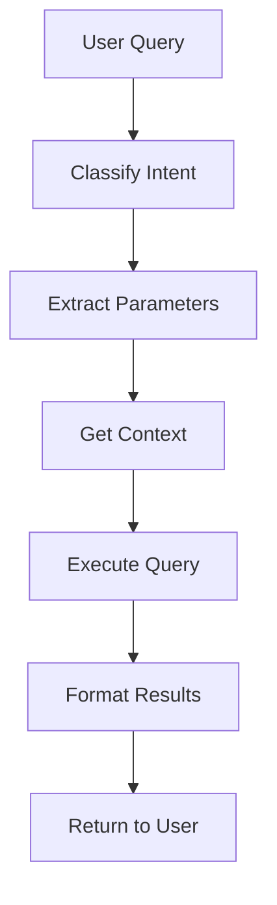

# BridgeInterface Component Documentation

The `BridgeInterface` class serves as the translation layer between Obsidian and MCP protocols. It processes natural language queries, classifies user intent, and coordinates between the knowledge engine and UI components.

## Class: BridgeInterface

**Location**: `src/bridge/bridge-interface.ts`

### Constructor

```typescript
constructor(app: App, knowledgeEngine: KnowledgeEngine, settings: MCPBridgeSettings)
```

Creates a new BridgeInterface instance.

**Parameters:**
- `app`: `App` - The Obsidian App instance
- `knowledgeEngine`: `KnowledgeEngine` - The knowledge discovery engine
- `settings`: `MCPBridgeSettings` - Plugin settings

### Properties

#### `app: App`
The Obsidian App instance for vault operations.

#### `knowledgeEngine: KnowledgeEngine`
The knowledge engine for content discovery and analysis.

#### `settings: MCPBridgeSettings`
Current plugin settings.

### Methods

#### `processQuery(query: string, context?: QueryContext): Promise<QueryResult>`

Processes a natural language query and returns structured results.

**Parameters:**
- `query`: `string` - The user's natural language query
- `context`: `QueryContext` (optional) - Additional context for the query

**Returns:** `Promise<QueryResult>` - Structured query results

**Example:**
```typescript
const result = await bridge.processQuery(
  'find my notes about machine learning',
  { currentFile: activeFile, selection: selectedText }
);
```

#### `classifyIntent(query: string): QueryIntent`

Classifies the intent of a user query.

**Parameters:**
- `query`: `string` - The user's query

**Returns:** `QueryIntent` - The classified intent

**Possible intents:**
- `'search'` - Search for existing content
- `'create'` - Create new content
- `'link'` - Find or create links
- `'suggest'` - Get content suggestions
- `'analyze'` - Analyze existing content
- `'help'` - Get help or instructions

**Example:**
```typescript
const intent = bridge.classifyIntent('show me related notes');
console.log(`Intent: ${intent}`); // 'search'
```

#### `executeQuery(query: string, intent: QueryIntent, context?: QueryContext): Promise<QueryResult>`

Executes a query with the specified intent.

**Parameters:**
- `query`: `string` - The user's query
- `intent`: `QueryIntent` - The classified intent
- `context`: `QueryContext` (optional) - Additional context

**Returns:** `Promise<QueryResult>` - Execution results

**Example:**
```typescript
const result = await bridge.executeQuery(
  'find machine learning papers',
  'search',
  { currentFile: activeFile }
);
```

#### `insertContent(content: string, location?: ContentLocation): Promise<void>`

Inserts content into the current note at the specified location.

**Parameters:**
- `content`: `string` - The content to insert
- `location`: `ContentLocation` (optional) - Where to insert the content

**Returns:** `Promise<void>`

**Example:**
```typescript
await bridge.insertContent('# New Section\n\nContent here', {
  position: 'cursor',
  format: 'markdown'
});
```

#### `createNewNote(title: string, content: string, template?: string): Promise<TFile>`

Creates a new note with the specified title and content.

**Parameters:**
- `title`: `string` - The title of the new note
- `content`: `string` - The initial content
- `template`: `string` (optional) - Template to use for the note

**Returns:** `Promise<TFile>` - The created note file

**Example:**
```typescript
const newNote = await bridge.createNewNote(
  'Machine Learning Notes',
  '# Machine Learning\n\nInitial content...'
);
```

#### `suggestLinks(content: string, context?: QueryContext): Promise<LinkSuggestion[]>`

Suggests potential links for the given content.

**Parameters:**
- `content`: `string` - The content to analyze for link suggestions
- `context`: `QueryContext` (optional) - Additional context

**Returns:** `Promise<LinkSuggestion[]>` - Array of link suggestions

**Example:**
```typescript
const suggestions = await bridge.suggestLinks(
  'This is about neural networks and deep learning'
);
```

#### `analyzeContent(content: string): Promise<ContentAnalysis>`

Analyzes content and provides insights.

**Parameters:**
- `content`: `string` - The content to analyze

**Returns:** `Promise<ContentAnalysis>` - Analysis results

**Example:**
```typescript
const analysis = await bridge.analyzeContent(currentNoteContent);
console.log(`Topics: ${analysis.topics.join(', ')}`);
```

#### `getCurrentContext(): QueryContext`

Gets the current context from the active Obsidian window.

**Returns:** `QueryContext` - Current context information

**Example:**
```typescript
const context = bridge.getCurrentContext();
console.log(`Current file: ${context.currentFile?.name}`);
```

#### `formatResponse(result: QueryResult): string`

Formats a query result for display to the user.

**Parameters:**
- `result`: `QueryResult` - The query result to format

**Returns:** `string` - Formatted response text

**Example:**
```typescript
const formatted = bridge.formatResponse(queryResult);
console.log(formatted);
```

#### `updateSettings(settings: MCPBridgeSettings): void`

Updates the bridge settings.

**Parameters:**
- `settings`: `MCPBridgeSettings` - New plugin settings

**Example:**
```typescript
bridge.updateSettings(newSettings);
```

## Type Definitions

### `QueryContext`

```typescript
interface QueryContext {
  currentFile?: TFile;
  selection?: string;
  cursorPosition?: number;
  currentSection?: string;
  recentFiles?: TFile[];
  tags?: string[];
  metadata?: any;
}
```

### `QueryResult`

```typescript
interface QueryResult {
  intent: QueryIntent;
  results: any[];
  suggestions: ContentSuggestion[];
  actions: QueryAction[];
  metadata: {
    searchTime: number;
    totalResults: number;
    sources: string[];
  };
}
```

### `QueryIntent`

```typescript
type QueryIntent = 
  | 'search'
  | 'create'
  | 'link'
  | 'suggest'
  | 'analyze'
  | 'help';
```

### `ContentLocation`

```typescript
interface ContentLocation {
  position: 'cursor' | 'start' | 'end' | 'after-selection';
  format: 'markdown' | 'plain' | 'html';
  section?: string;
}
```

### `LinkSuggestion`

```typescript
interface LinkSuggestion {
  text: string;
  target: string;
  type: 'internal' | 'external' | 'create';
  relevanceScore: number;
  context: string;
}
```

### `ContentAnalysis`

```typescript
interface ContentAnalysis {
  topics: string[];
  keywords: string[];
  sentiment: 'positive' | 'negative' | 'neutral';
  readabilityScore: number;
  wordCount: number;
  estimatedReadingTime: number;
  relatedNotes: string[];
}
```

### `QueryAction`

```typescript
interface QueryAction {
  type: 'insert' | 'create' | 'link' | 'search' | 'navigate';
  label: string;
  data: any;
  description?: string;
}
```

## Intent Classification

The BridgeInterface uses pattern matching and keyword analysis to classify user intents:

### Search Intent
- Keywords: "find", "search", "show", "list", "get"
- Examples: "find my notes about X", "search for papers on Y"

### Create Intent
- Keywords: "create", "new", "make", "add", "write"
- Examples: "create a note about X", "make a new document"

### Link Intent
- Keywords: "link", "connect", "relate", "reference"
- Examples: "link this to my other notes", "find related content"

### Suggest Intent
- Keywords: "suggest", "recommend", "ideas", "what", "help"
- Examples: "suggest content for this section", "what should I write about?"

### Analyze Intent
- Keywords: "analyze", "summarize", "explain", "understand"
- Examples: "analyze this text", "summarize my notes on X"

## Query Processing Flow



## Error Handling

The BridgeInterface implements comprehensive error handling:

- **Intent Classification Errors**: Falls back to generic search
- **Query Execution Errors**: Provides fallback suggestions
- **Content Insertion Errors**: Offers alternative locations
- **Context Retrieval Errors**: Uses minimal context

## Configuration

The BridgeInterface behavior can be configured through settings:

```typescript
{
  "bridgeInterface": {
    "enableIntentClassification": true,
    "enableContentSuggestions": true,
    "enableLinkSuggestions": true,
    "enableContentAnalysis": true,
    "maxSuggestions": 10,
    "confidenceThreshold": 0.6
  }
}
```

## Best Practices

1. **Provide Context**: Always include current file and selection context
2. **Handle Errors**: Implement fallbacks for all operations
3. **Validate Input**: Sanitize user queries before processing
4. **Cache Results**: Store frequent query results for performance
5. **User Feedback**: Provide clear feedback for all operations

## Example Usage

```typescript
import { BridgeInterface } from './bridge/bridge-interface';

// Initialize bridge
const bridge = new BridgeInterface(app, knowledgeEngine, settings);

// Process a natural language query
const result = await bridge.processQuery(
  'find my notes about machine learning',
  bridge.getCurrentContext()
);

// Create new content
await bridge.createNewNote(
  'ML Research Notes',
  '# Machine Learning Research\n\nInitial thoughts...'
);

// Insert content at cursor
await bridge.insertContent(
  '## Related Papers\n\n- Paper 1\n- Paper 2',
  { position: 'cursor', format: 'markdown' }
);

// Get link suggestions
const links = await bridge.suggestLinks(
  'This discusses neural networks and deep learning'
);
```